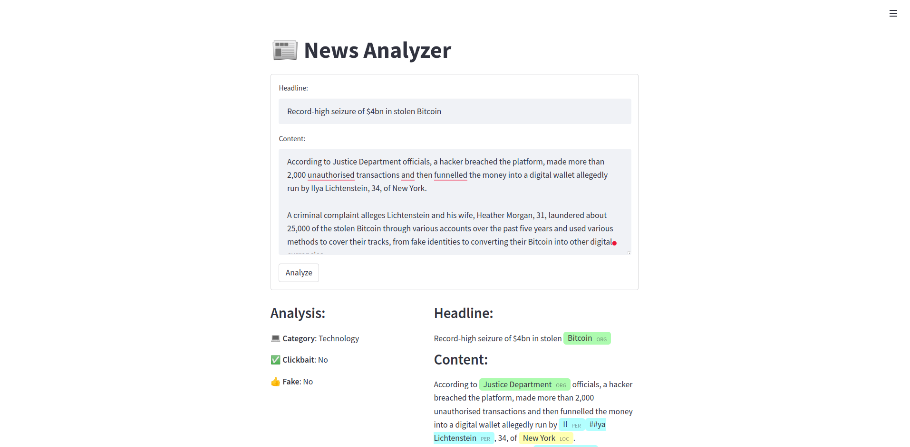

# News Analyzer

This application analyzes an article by using transformer models for 4 different tasks:
- Classify the article into the corresponding **category**.
- Detect whether the article is **fake** or not.
- Detect if the article headline is **clickbait** or not.
- Recognize different **named entities** in the text.   



## Installation

Install requirements:
```
pip install -r requirements.txt
```

## Build app
Run:
```
streamlit run app.py
```